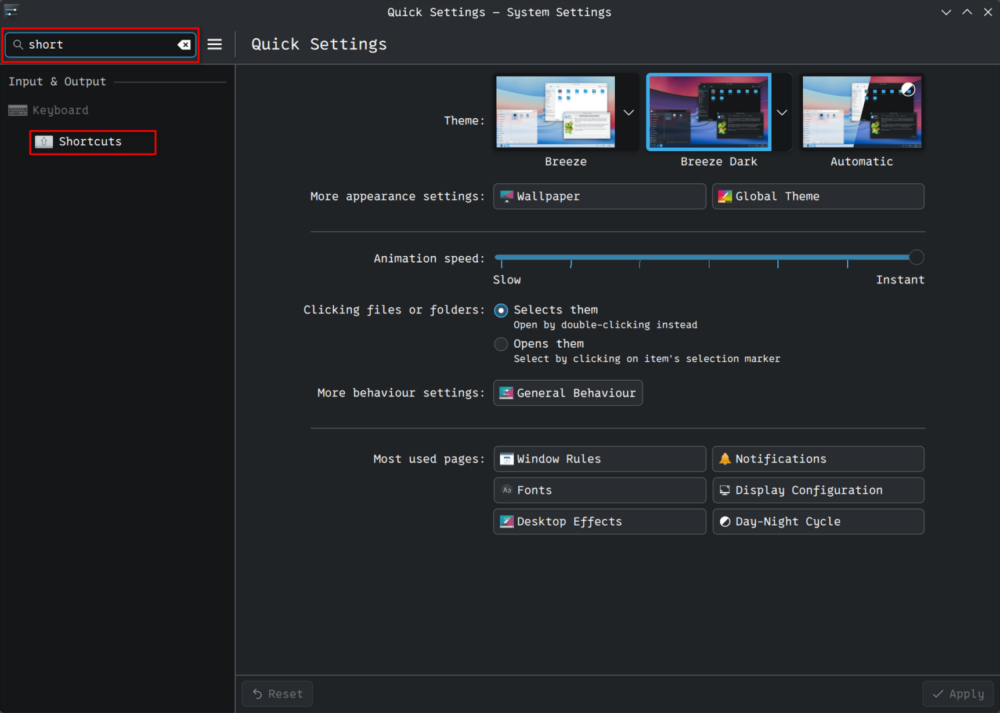
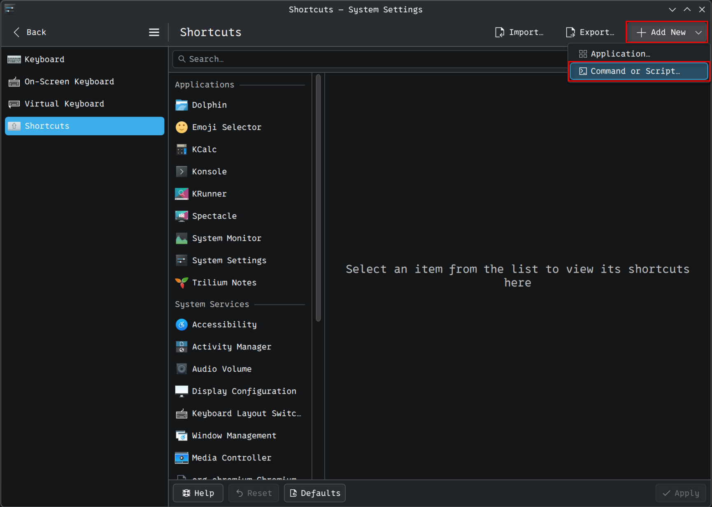
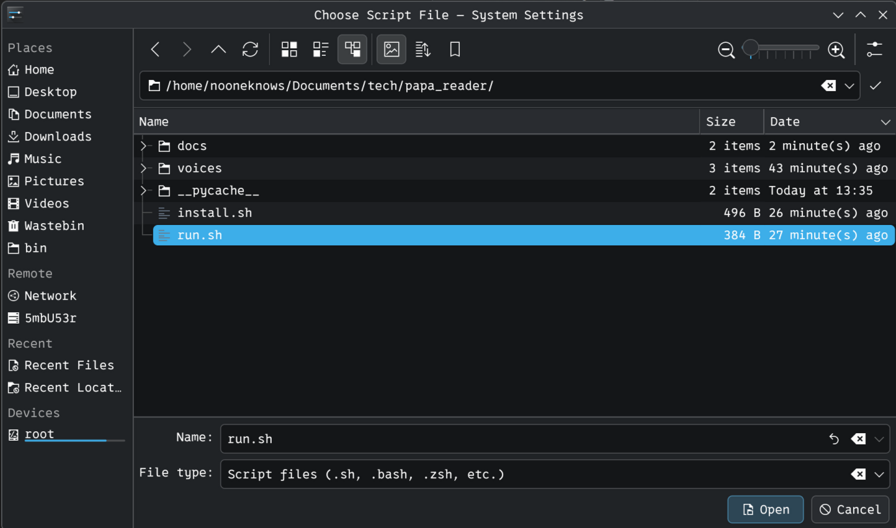
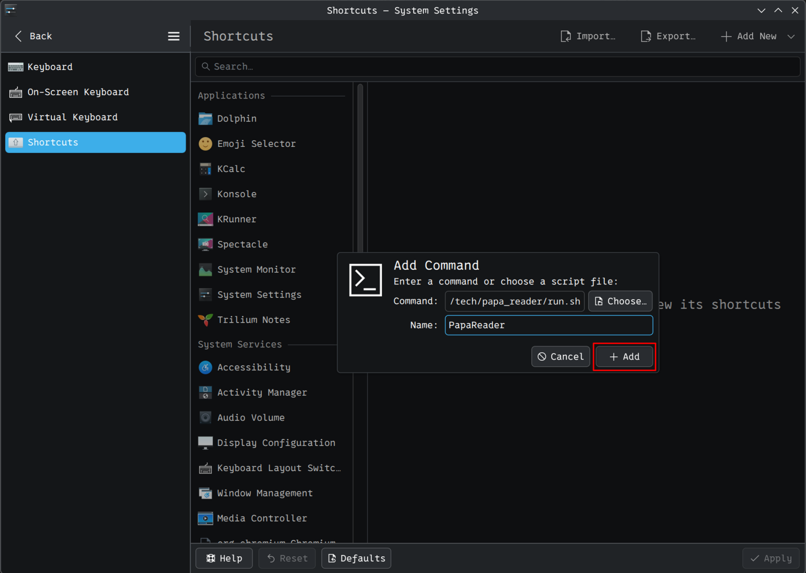
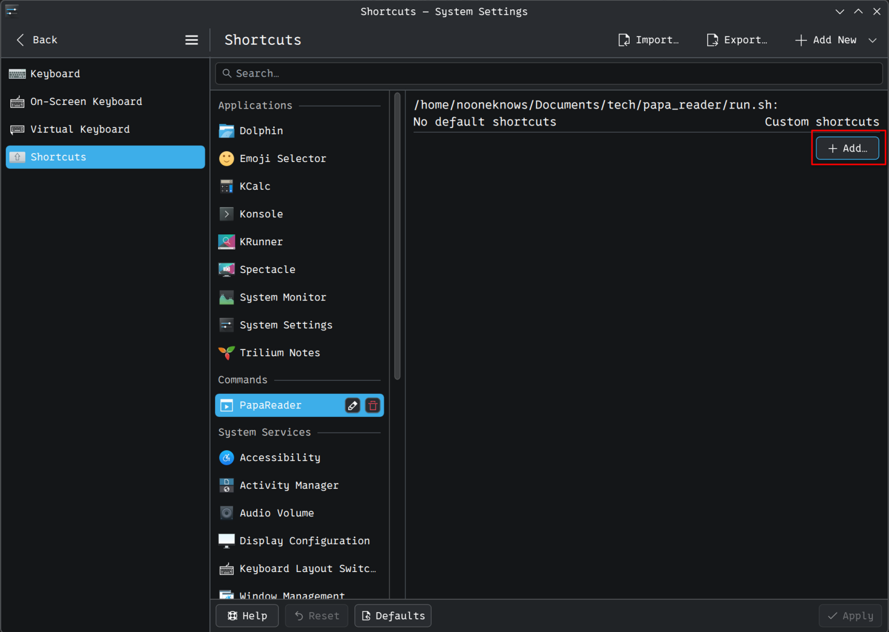
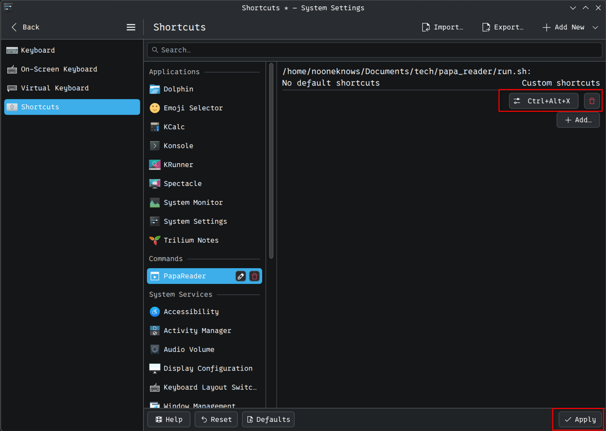
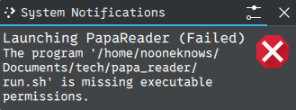

# Creating a Keyboard Shortcut (KDE)

This guide shows you how to set up a keyboard shortcut so you can run Papa Reader with a single key press — no Terminal needed.

---

## Step 1 — Open the Shortcuts settings

Open **System Settings**, type `short` in the search bar, and click **Shortcuts** on the left side.



---

## Step 2 — Add a new Command or Script

Click **+ Add New** in the top-right corner, then choose **Command or Script...** from the dropdown.



---

## Step 3 — Select the run.sh file

A file picker will open. Navigate to your Papa Reader folder and select the file called **run.sh**, then click **Open**.



---

## Step 4 — Name the shortcut

A small dialog will appear. The command field will already be filled in. In the **Name** field, type `PapaReader`, then click **+ Add**.



---

## Step 5 — Assign a key combination

You will see **PapaReader** appear under Commands. Click **+ Add...** on the right side to assign a key combination.



Press the key combination you want to use (for example **Ctrl+Alt+X**), then click **Apply** at the bottom-right to save.



---

## All done!

From now on:

1. **Highlight** any text on your screen
2. Press your chosen key combination (e.g. **Ctrl+Alt+X**)
3. Papa Reader will read the text aloud

---

## Troubleshooting

### "Launching PapaReader (Failed) — missing executable permissions"

If you see this notification, the `run.sh` file does not have permission to run as a program.



**Fix — option A (Terminal):**
```bash
chmod +x run.sh
```

**Fix — option B (no Terminal):**

Right-click on `run.sh` in your file manager, choose **Properties**, go to the **Permissions** tab, and tick **Allow executing file as program**. Then click OK.
